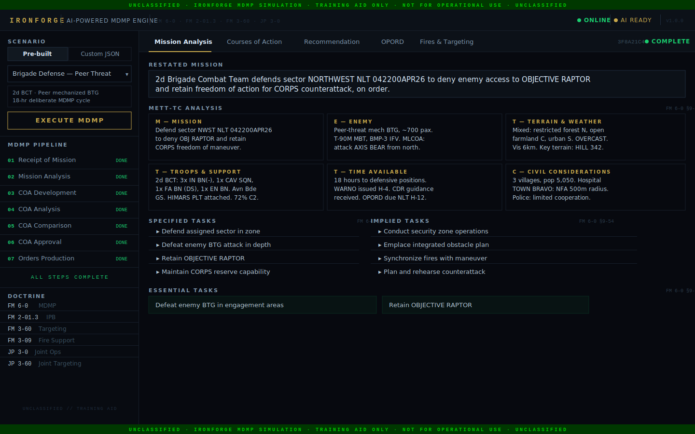
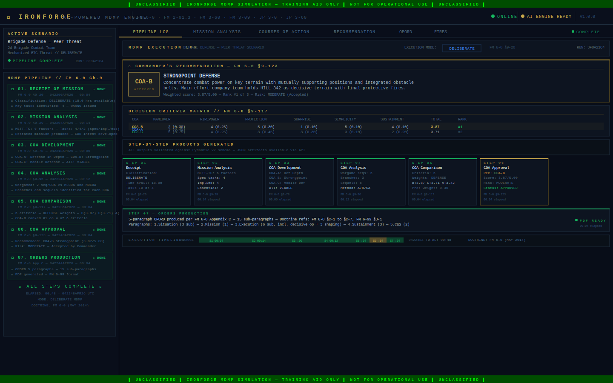
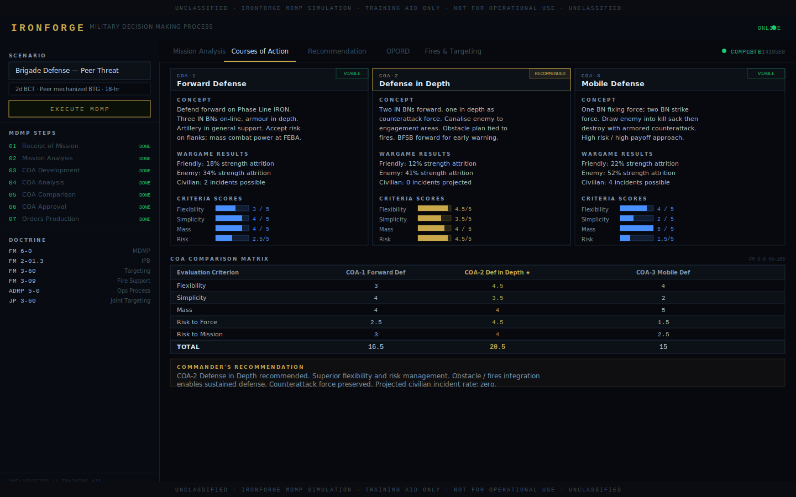
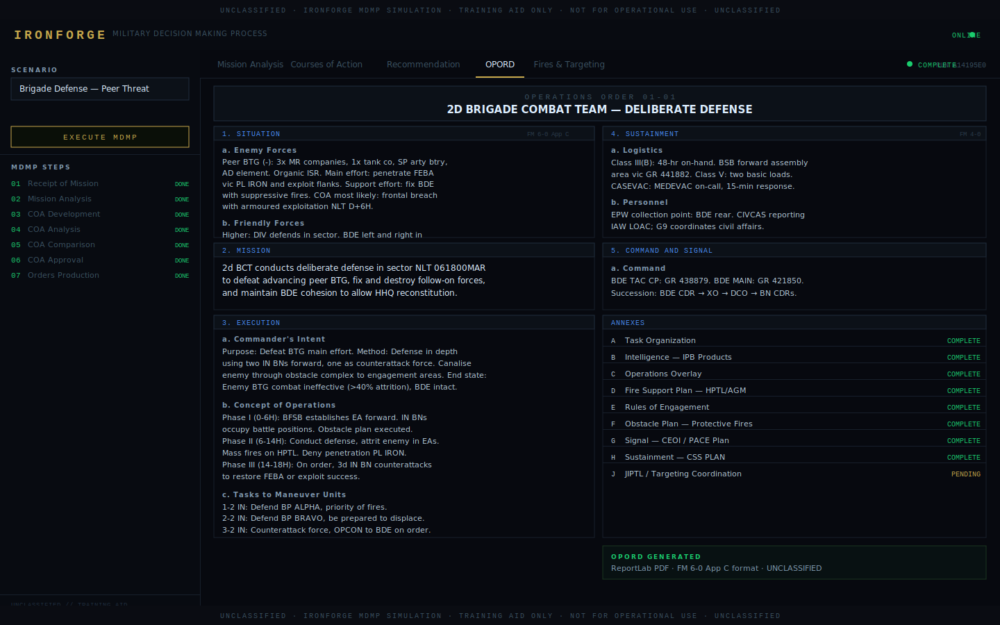
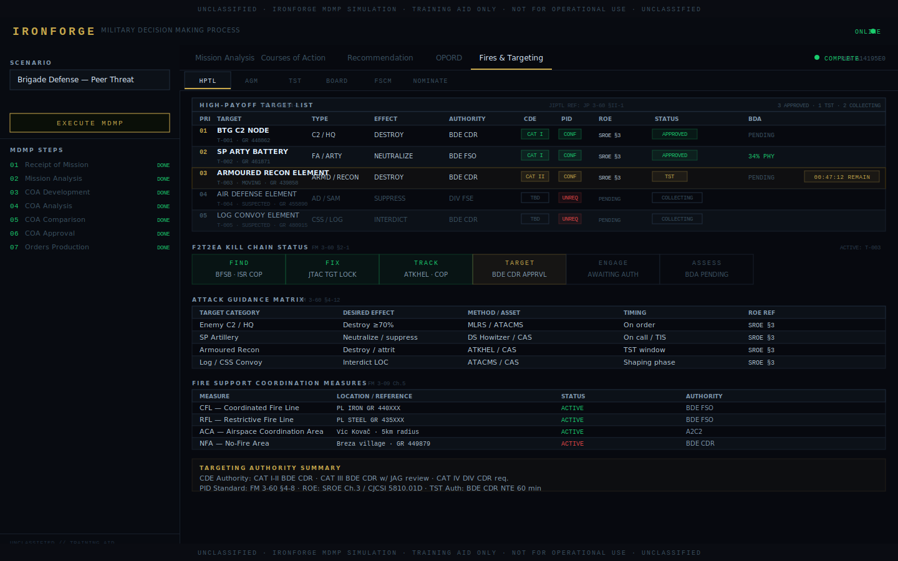

# IRONFORGE

> **The hardest problem in warfare is not firepower. It is the decision.**

---

## SITUATION

IRONFORGE is an AI-powered Military Decision Making Process (MDMP) engine — an open-source, unclassified academic framework that ingests a tactical scenario and reasons through it using the Army's seven-step MDMP as defined in **FM 6-0, Commander and Staff Organization and Operations**.

Every output is grounded in publicly available U.S. Army and Joint doctrine. Every planning factor is citable. Every algorithm maps to a real publication. If it cannot be cited, it does not exist in this codebase.

The standard: when a Brigade Targeting Officer opens this repository, they should recognize every step of the process they have spent their career executing.

---

## MISSION

IRONFORGE takes a tactical scenario in natural language or structured JSON and:

1. **Classifies the mission** — hasty, deliberate, or crisis action — per FM 6-0 §9-20
2. **Extracts METT-TC** — Mission, Enemy, Terrain and Weather, Troops, Time, Civil considerations — per FM 6-0 §9-32
3. **Develops three Courses of Action** — each with decisive, shaping, and sustaining operations — per FM 6-0 §9-78
4. **Wargames each COA** — structured action / reaction / counteraction sequences against doctrinal threat models — per FM 6-0 §9-105
5. **Compares COAs** — six-criterion weighted decision matrix — per FM 6-0 §9-117
6. **Recommends the optimal COA** — with justification, risk acceptance, and doctrine citations — per FM 6-0 §9-123
7. **Produces an OPORD fragment** — five-paragraph format with proper numbering — per FM 6-0 Appendix C, FM 6-99

---

## EXECUTION

### Prerequisites

- Python 3.10+
- Node.js 18+
- An Anthropic API key

### Quick Start

```bash
# Clone
git clone https://github.com/yourusername/ironforge.git
cd ironforge

# Python environment
python -m venv .venv && source .venv/bin/activate   # Windows: .venv\Scripts\activate
pip install -r requirements.txt

# Configuration
cp .env.example .env
# Set ANTHROPIC_API_KEY in .env

# Install frontend dependencies
cd webapp/frontend && npm install && cd ../..

# Launch (backend + frontend)
python start.py
```

Backend: `http://localhost:8000`  
Frontend: `http://localhost:3000`  
API docs: `http://localhost:8000/docs`

### Backend Only

```bash
python -m uvicorn webapp.backend.main:app --reload --port 8000
```

### Run MDMP Pipeline via API

```bash
curl -X POST http://localhost:8000/api/scenario \
  -H "Content-Type: application/json" \
  -d @scenarios/brigade_defense_peer_threat.json
```

Or load a pre-built scenario from the frontend scenario selector.

---

## ORGANIZATION — MODULE TABLE

| Module | Function | Primary Doctrine |
|--------|----------|-----------------|
| `ironforge/` | Core enumerations, base models, doctrine constants, planning factors | FM 6-0, JP 3-0, FM 2-01.3 |
| `mdmp/step01_receipt.py` | Mission classification, time available, initial key tasks | FM 6-0 §9-20 to §9-27 |
| `mdmp/step02_mission_analysis.py` | METT-TC extraction, task identification, mission restatement | FM 6-0 §9-29 to §9-77 |
| `mdmp/step03_coa_development.py` | Three COAs with decisive/shaping/sustaining operations | FM 6-0 §9-78 to §9-95 |
| `mdmp/step04_coa_analysis.py` | Wargaming: action/reaction/counteraction, strengths, weaknesses | FM 6-0 §9-96 to §9-116 |
| `mdmp/step05_coa_comparison.py` | Six-criterion weighted decision matrix | FM 6-0 §9-117 to §9-122 |
| `mdmp/step06_coa_approval.py` | Recommended COA with justification and risk acceptance | FM 6-0 §9-123 to §9-128 |
| `mdmp/step07_orders_production.py` | Five-paragraph OPORD fragment with proper numbering | FM 6-0 App C, FM 6-99 |
| `intelligence/ipb.py` | Four-step IPB process | FM 2-01.3 |
| `intelligence/terrain.py` | OCOKA terrain analysis | FM 2-01.3 §2-4 |
| `intelligence/threat_templates.py` | Peer/near-peer/irregular/hybrid threat templates | FM 2-01.3 §3-1 |
| `intelligence/nai_generator.py` | Named Area of Interest development | FM 2-01.3 §3-45 |
| `fires/targeting.py` | F2T2EA kill chain targeting cycle | FM 3-60 §2-1, JP 3-60 |
| `fires/hptl.py` | High Payoff Target List management | FM 3-60 §4-1 |
| `fires/fscm.py` | Fire Support Coordination Measures | FM 3-09 Ch.5 |
| `assets/` | Unit capability modeling and doctrinal planning factors | FM 3-09, FM 3-60, TOE references |
| `ai_engine/` | Claude claude-sonnet-4-20250514 reasoning core with MDMP doctrine system prompt | FM 6-0, ADRP 5-0, JP 3-0 |
| `webapp/backend/` | FastAPI REST API with PDF generation | — |
| `webapp/frontend/` | Next.js military terminal decision support UI | — |
| `scenarios/` | Five demonstration scenarios with complete METT-TC data | — |

---

## SCREENSHOTS

> Brigade Defense Against a Peer Threat Armored Assault — 2d BCT, deliberate MDMP, 18-hour planning cycle.

### Scenario Input with METT-TC Extraction



*Brigade Defense scenario loaded. All six METT-TC factors extracted. Restated mission, specified tasks, implied tasks, and essential tasks produced. FM 6-0 §9-29 to §9-77.*

---

### Seven-Step MDMP Pipeline — All Steps Complete



*Full seven-step pipeline execution log. Step timestamps, products generated at each step, COA approval result, and total elapsed time. Decision criteria matrix with weighted scores. FM 6-0 Chapter 9.*

---

### Three Courses of Action with Wargaming Results



*Three distinct COAs developed for a DEFENSE mission. Each card shows concept of operations, decisive operation, wargaming action/reaction/counteraction sequences, and six-criterion scoring. COA-B (Strongpoint Defense) recommended at 3.87/5.00. FM 6-0 §9-78 / §9-96 / §9-117.*

---

### Five-Paragraph Operations Order



*Complete OPORD fragment formatted per FM 6-0 Appendix C and FM 6-99. Five paragraphs: Situation, Mission, Execution (with decisive and shaping operations), Sustainment, Command and Signal. DTG block, classification markings, and doctrine citations. UNCLASSIFIED.*

---

### Fires Integration — HPTL and Attack Guidance Matrix



*High Payoff Target List with F2T2EA kill chain status for five nominated targets. Attack Guidance Matrix with priority, desired effect, means, and restrictions. Fire Support Coordination Measures. FA planning factors from FM 3-09. FM 3-60 §4-1 / §4-12 / JP 3-60.*

---

## DEMONSTRATION SCENARIOS

Five scenarios are included with complete METT-TC data, suitable for demonstrating the full MDMP pipeline.

| Scenario | Mission Type | Key Challenge |
|----------|-------------|---------------|
| `time_sensitive_targeting` | TARGETING | 4-hour window; urban environment; collateral damage constraints |
| `brigade_defense_peer_threat` | DEFENSE | Peer mechanized BTG attack; 18-hour planning cycle |
| `cyber_physical_fob` | DEFENSE | Combined cyber + physical threat; C2 degradation |
| `contested_airspace_cas` | OFFENSE | Degraded comms; JTAC coordination; contested airspace |
| `multi_domain_strike` | TARGETING | Joint kinetic + cyber + EW + space integration; IADS defeat |

Load any scenario via the frontend selector or directly via API:

```bash
curl http://localhost:8000/api/scenarios/brigade_defense_peer_threat
```

---

## SUSTAINMENT — TECH STACK

| Component | Technology |
|-----------|-----------|
| AI Reasoning | Claude claude-sonnet-4-20250514 (Anthropic) |
| Backend | Python 3.10+, FastAPI, Pydantic v2, Uvicorn |
| Frontend | Next.js 15, TypeScript, Tailwind CSS |
| PDF Generation | ReportLab |
| Data Validation | Pydantic v2 |
| Testing | Pytest |
| CI | GitHub Actions |

---

## DOCTRINE BIBLIOGRAPHY

All capabilities in IRONFORGE are grounded in the following publicly available publications.

| Publication | Title | Date | IRONFORGE Use |
|-------------|-------|------|---------------|
| FM 6-0 | Commander and Staff Organization and Operations | May 2014 | MDMP seven-step framework (Ch. 9), OPORD format (App. C) |
| FM 2-01.3 | Intelligence Preparation of the Battlefield | July 2009 | IPB four-step process, OCOKA, threat templates, NAI/TAI |
| FM 3-60 | The Targeting Process | November 2023 | F2T2EA kill chain, HPTL, AGM, target nomination workflow |
| FM 3-09 | Fire Support and Field Artillery Operations | April 2023 | FSCM, fire planning, artillery integration |
| FM 6-99 | U.S. Army Report and Message Formats | August 2006 | OPORD paragraph formatting and numbering standards |
| ADRP 5-0 | The Operations Process | May 2012 | Commander's decision cycle, operations process framework |
| ADP 3-0 | Operations | July 2019 | Unified land operations, combined arms |
| JP 3-0 | Joint Operations | June 2022 | Joint planning fundamentals, operational art |
| JP 3-60 | Joint Targeting | April 2018 | Joint targeting cycle, joint HPTL |
| TRADOC Pam 525-3-1 | The U.S. Army in Multi-Domain Operations 2028 | December 2018 | MDO framework, multi-domain task force |

Full citation details including chapter and paragraph references are in [docs/bibliography.md](docs/bibliography.md).

---

## COMMAND AND SIGNAL

### API Reference

| Endpoint | Method | Description |
|----------|--------|-------------|
| `/api/scenario` | POST | Submit scenario; run full MDMP pipeline |
| `/api/mdmp/{run_id}/status` | GET | Pipeline step completion status |
| `/api/mdmp/{run_id}/coas` | GET | Retrieve three COAs with wargaming |
| `/api/mdmp/{run_id}/recommendation` | GET | Recommended COA with justification |
| `/api/mdmp/{run_id}/opord` | GET | Five-paragraph OPORD fragment |
| `/api/mdmp/{run_id}/refine` | POST | Iterative AI refinement |
| `/api/mdmp/{run_id}/report.pdf` | GET | Download PDF OPORD |
| `/api/fires/targets` | POST | Target nomination (F2T2EA) |
| `/api/scenarios` | GET | List pre-built scenarios |
| `/api/scenarios/{name}` | GET | Load scenario by name |

Interactive API documentation: `http://localhost:8000/docs`

---

## DISCLAIMER

IRONFORGE is an **unclassified academic simulation and training aid**.

All doctrine references, planning factors, and models are derived exclusively from publicly available, declassified U.S. Army and Joint publications. This software does not represent actual classified systems, operational capabilities, or real unit data. It is intended for educational, research, and demonstration purposes only.

See [DISCLAIMER.md](DISCLAIMER.md) for the full statement.

---

## LICENSE

Released under the **MIT License**.

```
Copyright (c) 2026 IRONFORGE Contributors

Permission is hereby granted, free of charge, to any person obtaining a copy
of this software and associated documentation files (the "Software"), to deal
in the Software without restriction, including without limitation the rights
to use, copy, modify, merge, publish, distribute, sublicense, and/or sell
copies of the Software, and to permit persons to whom the Software is
furnished to do so, subject to the following conditions:

The above copyright notice and this permission notice shall be included in all
copies or substantial portions of the Software.

THE SOFTWARE IS PROVIDED "AS IS", WITHOUT WARRANTY OF ANY KIND, EXPRESS OR
IMPLIED, INCLUDING BUT NOT LIMITED TO THE WARRANTIES OF MERCHANTABILITY,
FITNESS FOR A PARTICULAR PURPOSE AND NONINFRINGEMENT.
```

---

*IRONFORGE — Every output traceable. Every reference cited. Every step doctrinal.*
